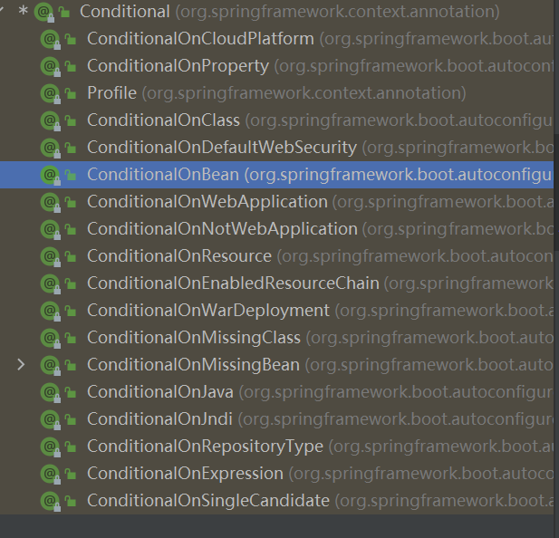

# spring_boot_demo
练习Springboot

#### SpringbootApplication same as  @SpringbootConfiguration @EnableAutoConfiguration @ComponentScan

#### @RestFullController same as @Controller + @ResponseBody

 proxyBeanMethods 代理bean的方法

  Full :proxyBeanMethods = true

  Lite :proxyBeanMethods = false

 应对组件依赖问题

#### 配置类 组件 之间没有依赖关系（一个bean中用了另一个bean）时，使用Lite模式，加速容器启动过程，减少判断

#### 配置类组件之间有依赖关系，方法会调用容器中的单实例组件，使用Full 模式

@Import({User.class, DBHelper.class})

Import 的参数是一个class类型的数组，里面可以导入任意的第三方组件，id默认是全类名，我们使用@Bean注册的组件和这个导入的组件不是同一个

@Conditional 条件装备

@ImportResource("classpath:/beans.xml")

ImportResource 用来导入 旧的 注册的大量bean

## 配置绑定的几种方式

##### 自己定义： @Component + @ConfigurationProperties(prefix = "properties中对应类中的属性前缀")

#####  @EnableConfigurationProperties(第三方类.class) + @ConfigurationProperties(prefix = "properties中对应类中的属性前缀")

1、开启Car配置绑定功能

2、把这个Car这个组件自动注册到容器中

## @EnableAutoConfiguration
里面：

@AutoConfigurationPackage  ： @Import({Registrar.class}) 给容器中导入一个组件
利用Register给容器中导入一系列组件  将指定的一个包下的所有组件都导入进来 主程序类所在包下（标注了@SpringBootApplication）

@Import({AutoConfigurationImportSelector.class})

### 按需开启自动配置

有100多个场景的所有自动配置启动的时候默认全部加载，
但是按条件装配规则，最终会按需配置

## Springboot 配置原理
1、Spring先加载所有的自动配置类 xxxAutoConfiguration

2、每个自动配置类按照条件进行生效，默认都会绑定配置文件指定的值，xxxProperties 里面拿， xxxProperties 和配置文件进行了绑定

3、生效的配置类就会给容器装配很对组件

4、只要容器中有这些组件,相当于这些功能就有了

5、定制化配置
    用户直接自己@Bean 替换掉底层的组件
    用户去看这个组件是获取的配置文件中的什么值，就可有定位去修改

流程： xxxAutoConfiguration ---> 组件  ---->  xxxProperties 

org.springframework.boot.autoconfigure 找到这个包，然后找到对应的自动配置类，再找注解

